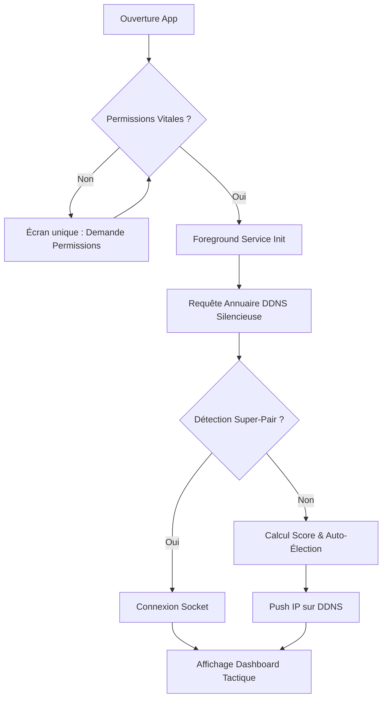
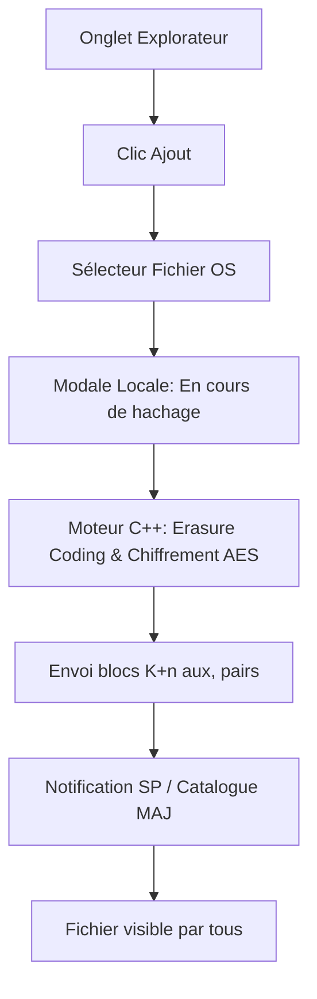

# UX Design Specification PFE

**Author:** Naoui
**Date:** 2026-03-27T00:47:16+01:00

---

## Executive Summary

### Project Vision

MobiCloud transforme un groupe de smartphones géolocalisés à proximité (campus, zones de crise, conférences) en un cloud de stockage autonome, sécurisé et intelligent, sans nécessiter d'Internet ou de serveur central. Le système repose sur l'IA pour prédire la fiabilité des nœuds, ajuste la redondance des fichiers dynamiquement, et garantit une sécurité absolue (Zero-Trust) où aucun hébergeur ne peut lire les données qu'il stocke.

### Target Users

1. **Étudiants en amphi / Campus :** Ont besoin d'échanger des cours et des fichiers lourds localement de manière transparente.
2. **Participants de conférences :** Souhaitent distribuer ou récupérer des médias (présentations, photos) au sein d'un événement éphémère.
3. **Équipes de terrain / Zones blanches :** Nécessitent un système de sauvegarde critique et résilient face aux conditions imprévisibles.
4. **Chercheurs / IoT :** Cherchent à agréger des données locales depuis un réseau de capteurs distribué.

### Key Design Challenges

- **Rendre le Zero-Trust tangible :** L'interface doit rassurer les utilisateurs que leurs données sont morcelées et indéchiffrables par les pairs qui les hébergent.
- **Transparence utilitariste de l'état du réseau :** Le défi est de faire remonter l'état du Foreground Service vers l'UI en Jetpack Compose (via des Flows), sans réveiller l'écran ou le CPU inutilement.
- **Gestion stricte de l'énergie (NFR-03) :** Le système fonctionnant principalement sur batterie, l'interface doit encourager la confiance sans consommer de cycles CPU ou de batterie pour des effets visuels superflus.

### Design Opportunities

- **Gamification de l'Hébergement (Karma) :** Capitaliser visuellement sur le "Ratio de Réciprocité" pour créer un profil utilisateur valorisant l'hébergement de données et décourageant le parasitisme (free-riding).
- **Tableau de bord statique et économe :** Créer un "cadran de diagnostiques" clair et basse consommation affichant les métriques essentielles (Batterie locale, Score IA, Karma) plutôt qu'une cartographie animée coûteuse en énergie.
- **Explorateur de fichiers DHT P2P :** L'interface principale doit se concentrer sur l'efficacité utilitariste d'un explorateur de fichiers décentralisé, offrant une navigation rapide sans fioritures.
- **Onboarding sans friction :** Intégrer l'authentification et la génération des clés cryptographiques de manière transparente lors de la première connexion.

## Core User Experience

### Defining Experience

La valeur fondamentale de MobiCloud réside dans deux interactions principales : la navigation intuitive dans un explorateur de fichiers décentralisé (DHT) et la surveillance rassurante de la santé de son propre appareil au sein du réseau, via un tableau de bord statique et utilitariste.

### Platform Strategy

- **Native Android :** Interface développée exclusivement de manière native (Jetpack Compose).
- **Background-first (Headless) :** Le cœur du système s'exécute silencieusement via un Foreground Service (maintien du MulticastLock, découverte BLE, transferts Wi-Fi Direct), permettant au réseau de survivre même lorsque l'écran est éteint.
- **UI Réactive et Économe :** L'interface utilisateur ne calcule rien : elle se contente d'observer les états émis par le service en arrière-plan via des Kotlin StateFlow, évitant tout réveil inutile du CPU.

### Effortless Interactions

- **Rejoindre le cloud éphémère :** L'authentification mutuelle, l'échange de clés publiques et la découverte des pairs se font instantanément et de façon invisible dès le lancement (« Zéro-configuration »).
- **Stockage Fire-and-Forget :** Le dépôt d'un fichier déclenche automatiquement son fractionnement, son chiffrement par bloc (Zero-Trust), le calcul de la redondance adaptative et sa distribution anti-corrélée sans que l'utilisateur ait à configurer quoi que ce soit.

### Critical Success Moments

- **Magie du hors-ligne :** Le moment où un utilisateur télécharge instantanément un document alors que son appareil n'a ni 4G ni Wi-Fi Internet.
- **Hausse du Karma :** La satisfaction de voir son "Ratio de Réciprocité" (Karma) s'envoler après avoir hébergé de manière invisible les données du réseau, débloquant la capacité de publier ses propres fichiers lourds.
- **Preuve d'efficience :** Le constat, après plusieurs heures de séminaire, que MobiCloud en tâche de fond n'a drainé que 2 ou 3% de la batterie.

### Experience Principles

1. **L'utilitarisme comme boussole :** Prioriser de l'information claire et statique face aux animations coûteuses en énergie.
2. **Confiance par la clarté :** Exposer les métriques vitales (Score IA de Fiabilité, Batterie, Karma) pour rendre le "Zero-Trust" et l'équité tangibles.
3. **Zéro-friction cryptographique :** La complexité cryptographique doit être mathématiquement paranoïaque en backend, mais totalement invisible en frontend.

## Desired Emotional Response

### Primary Emotional Goals

- **Confiance Absolue (Trust) :** L'utilisateur doit avoir la certitude intuitive que ses données sont en sécurité, même lorsqu'elles sont physiquement stockées chez des inconnus.
- **Autonomie (Empowerment) :** Le soulagement profond de pouvoir sauvegarder et échanger des données critiques alors que toute infrastructure classique (Internet/Wi-Fi public) est défaillante ou absente.
- **Fierté Communautaire (Pride) :** Le sentiment d'être un membre utile et récompensé d'un réseau d'entraide local, valorisé par le système de Karma.

### Emotional Journey Mapping

- **Découverte (Onboarding) :** Curiosité face à la "magie technique" du P2P invisible, suivie d'un puissant soulagement de la connectivité spontanée.
- **Action Principale (Dépôt d'un fichier) :** Sécurité. L'interface suggère clairement que le fichier est "scellé et fragmenté" avant de quitter le téléphone.
- **Tâche de fond (Hébergement) :** Sérénité (Calm). L'utilisateur sait que l'application tourne, mais le cadran de diagnostic statique prouve que sa batterie est en sécurité (NFR-03).
- **Situation de Crise (Batterie critique) :** Sentiment de contrôle. Au lieu de la panique, l'UI indique simplement une "Évacuation d'Urgence" automatisée et maîtrisée.

### Micro-Emotions

- **Confiance > Scepticisme :** Vaincre la résistance psychologique initiale du concept "je laisse mes fichiers à des inconnus".
- **Sérénité > Anxiété énergétique :** Désamorcer la peur historique des applications P2P qui drainent la batterie des smartphones.
- **Accomplissement > Passivité :** Transformer l'hébergement passif en une boucle de gameplay gratifiante (Karma).

### Design Implications

- **Design de Confiance (Zero-Trust) ➔** Emploi de métaphores visuelles de sécurité (cadenas, blocs, fragmentation cryptographique chiffrée) au moment de l'envoi.
- **Design de Sérénité (Batterie) ➔** Esthétique utilitariste, mode sombre profond (économie OLED), absence totale d'animations superflues, typographie "data-driven" (style terminal/monospace) pour le cadran de diagnostic.
- **Design de Fierté (Karma) ➔** Mise en majesté du "Ratio de Réciprocité" dans le profil, associant la fiabilité de l'appareil à la réputation de l'utilisateur.

### Emotional Design Principles

1. **La transparence détruit la méfiance :** Exposer les scores bruts (Batterie, Score IA) désamorce la peur de la boîte noire algorithmique.
2. **La sobriété comme signal de performance :** Une interface sévère, statique et ultra-rapide communique implicitement le sérieux énergétique de l'application.
3. **Récompenser l'altruisme réseau :** Héberger des données pour les autres n'est pas une corvée invisible, c'est un statut gagné.

## UX Pattern Analysis & Inspiration

### Inspiring Products Analysis

- **Syncthing / Resilio Sync (Partage P2P) :** Brillent par leur clarté sur la gestion des "Nœuds" et les jauges de synchronisation fragmentées. L'état de santé des pairs connectés est un modèle d'efficacité.
- **Bridgefy / Briar (Messagerie Offline) :** Excellentes dans l'expérience de découverte Bluetooth sans compte utilisateur ("magie" du mesh). Cependant, leur esthétique peut parfois sembler trop militante ou brute pour le grand public.
- **System Settings Android (Paramètres de Batterie/Stockage) :** La référence absolue pour inspirer confiance. L'utilisation de graphiques vectoriels statiques, de chiffres bruts et d'un layout épuré donne un sentiment de contrôle technique total sans consommer d'énergie.

### Transferable UX Patterns

**Navigation Patterns :**
- *Bottom Navigation Bar* à trois onglets stricts : Explorateur DHT (Fichiers) | Tableau de Bord (Mon Nœud) | Réseau (Pairs détectés). Sans menus tiroirs complexes.

**Interaction Patterns :**
- *Statut de Service Persistant :* Une petite pastille de couleur globale (Vert/Ambre/Rouge) près du titre de l'application indiquant de façon non-intrusive la santé du Foreground Service.
- *Micro-feedbacks cryptographiques :* Des icônes "cadenas" ou "matrices" qui s'activent de façon statique lors de l'upload pour signifier visuellement le découpage (Erasure Coding).
- *Feedback d'attente technique :* Remplacer le "syndrome de l'écran vide" lors des négociations Wi-Fi Direct (3-5 sec) par un log console court statique plutôt qu'un spinner animée, préservant la batterie tout en informant l'avancée.

**Visual Patterns :**
- *Dark Hub OLED :* Des fonds vraiment noirs (#000000) pour éteindre les pixels, avec l'utilisation de couleurs d'accentuation haute-visibilité (ex: un vert terminal ou un ambre orangé) uniquement pour les données vitales (Karma, Batterie).

### Anti-Patterns to Avoid

- **La "Galaxie" animée :** Représenter les nœuds par des particules flottantes en mouvement (drainage massif de batterie).
- **Le tunnel d'onboarding lourd :** Imposer des écrans de création de profil alors que le réseau est asynchrone et sans serveur central ("Zéro-configuration" requis).
- **Le syndrome de l'écran vide ("Empty State" silencieux) :** Un explorateur de fichiers vide sans feedback sur la recherche en cours des pairs BLE.

### Design Inspiration Strategy

**What to Adopt :**
- L'esthétique "Terminal/Système" des paramètres natifs Android pour le cadran de diagnostic.
- Le concept de "Jauges de fragments" vu dans les clients Torrent/Syncthing pour montrer l'avancement multiparts d'un fichier.

**What to Adapt :**
- Simplifier l'UI de gestion des pairs pour ne montrer qu'un "compteur de pairs à portée".

**What to Avoid :**
- Les animations SVG continues (Lottie) de l'UX grand public classique.

## Design System Foundation

### 1.1 Design System Choice

**Material Design 3 "Override" (Ultra-Lean & Static)**

Pour MobiCloud, nous adoptons une approche pragmatique : conserver la base robuste de Material Design 3 (imposée par notre starter technique Android `atick-faisal/Jetpack-Android-Starter`) mais en appliquant un "override" global systématique pour la forcer à se conformer à notre vision utilitariste et basse consommation.

### Rationale for Selection

- **Alignement Architectural :** Garantit la compatibilité directe avec l'Epic 0 (Initialisation du Starter) et évite de réinventer la gestion de l'accessibilité ou des layouts de base.
- **Zero-Overhead Énergétique (NFR-03) :** Bien que MD3 inclue nativement des animations, l'override de ses thèmes (`RippleTheme`, `LocalIndication`) permet d'éliminer à la racine ces cycles de rendu (GPU/CPU) non-essentiels.
- **Identité "Dashboard de Cyber-Sécurité" préservée :** La possibilité de forcer sélectivement le mode sombre, le fond OLED pur et les tokens typographiques nous donne cette sévérité recherchée.

### Implementation Approach

- **Dark Mode OLED Pur Forcé :** Appliquer un `colorScheme` en mode sombre uniquement, écrasant le fond d'écran (`background`) à `#000000` (True Black) pour éteindre physiquement un maximum de pixels.
- **Interactions Hyper-Statiques :** Écraser globalement le comportement des clics pour remplacer les ondulations tactiles (Ripples) par un état visuel plat et instantané, respectant l'objectif d'absence d'animation.
- **Typographie Data-Driven Remplacée :** Remplacer les tokens typographiques par défaut de MD3. Utiliser une Sans-Serif nette (Inter/Roboto) alliée à une police Monospace stricte (ex: JetBrains Mono/Roboto Mono) pour les chiffres et les états, évitant le tremblement de la grille.

### Customization Strategy

- **Palette Restreinte "Monitoring" imposée au `colorScheme` :** Rediriger les couleurs primaires/secondaires vers la palette drastiquement limitée : Noir absolu (Fonds), Gris technique (Textes), Vert Terminal (Sain), Ambre Fluorescent (Alerte).
- **Tokens Rigides :** Intégration stricte via un fichier `MobiCloudTheme` encadrant les composants Material, forçant les développeurs à respecter l'esthétique "sévère".

## Information Architecture & Screen Flow

L'architecture de l'information de MobiCloud est conçue pour être plate (flat navigation), évitant les sous-menus profonds afin de garantir un accès immédiat aux fonctions utilitaires.

### 1. Flux d'Onboarding (Topologie Zéro-Configuration)

- **Écran d'Amorçage (Splash / Init) :**
  - Exécution silencieuse : Génération de la paire de clés cryptographiques locales.
- **Écran des Permissions (Vital) :**
  - Demandes groupées (Bluetooth/BLE, Localisation/Wi-Fi Direct, Stockage, Notifications pour le Foreground Service).
  - *Micro-copy :* Explication utilitariste ("Pourquoi nous avons besoin de ces accès pour créer le réseau hors-ligne").
- *Redirection automatique et définitive vers l'Explorateur.*

### 2. Navigation Principale (Bottom Navigation Bar)

#### Onglet 1 : Explorateur DHT (Écran par défaut)
C'est le cœur de l'interaction "Fire-and-Forget".
- **Top Bar :** Titre + Pastille globale de statut du Foreground Service (Vert/Ambre/Rouge).
- **Vue Principale (Liste) :** Fichiers découverts sur le réseau local.
  - *Composant Fichier :* Nom, Poids brut, Statut de disponibilité (Jauge de complétion des fragments, ex: 10/10 blocs).
- **Floating Action Button (Upload) :**
  - Action "Partager un fichier local".
  - *Feedback Visuel :* Modale transitoire montrant la jauge de découpage (Erasure Coding) et de chiffrement (Icône Cadenas) avant injection sur le réseau.

#### Onglet 2 : Mon Nœud (Tableau de Bord Diagnostique)
L'écran matérialisant la "Confiance et la Fierté" (NFR-03 & Anti-clandestin).
- **En-tête Identité :** Hash tronqué du nœud (ex: `0x4F...B2A`).
- **Bloc "Santé & Énergie" :**
  - Score IA de Fiabilité (0-100%).
  - Impact Batterie (estimation statique, ex: `-2.4%/heure`).
- **Bloc "Karma & Réciprocité" :**
  - Ratio de Réciprocité (Volume Hébergé vs Volume Publié).
  - Palier/Statut communautaire (ex: *Contributeur Solide*, *Nouveau Nœud*).
- **Bloc "Stockage" :**
  - Jauge utilitariste de l'espace alloué aux fragments tiers vs Espace total disponible.

#### Onglet 3 : Réseau P2P (Statut de la Constellation)
Permet de diagnostiquer l'état du "Datalake" sans animations coûteuses.
- **Cartes de Synthèse (Cards) :**
  - Nœuds découverts (BLE).
  - Connexions actives (Wi-Fi Direct).
- **Console de Logs (Terminal-style) :**
  - Un composant texte défilant affichant les événements bruts du Foreground Service (`Découverte pair X...`, `Négociation WFD locale...`, `Réception fragment partiel...`). Cela remplace le "syndrome de l'écran vide" lors des temps de latence réseau.

### 3. États Globaux Transverses

- **Alertes de Migration (Snackbar/Bannière) :** Si la batterie devient critique, une bannière ambre informe de façon persistante : "Évacuation d'urgence en cours..."

## Visual Design Foundation

### Color System

Adoptant un "Dark Mode OLED Pur Forcé", le système de couleurs est pragmatique :
- **Backgrounds :** `#000000` (Neutral Black) exclusif. Économie d'énergie pure.
- **Primary Text :** `#E0E0E0`. Secondary Text: `#9E9E9E`. Bordures : `#333333`.
- **Semantic Accents :** 
  - `Success/Active` : `#00FF41` (Vert Terminal, pour l'état sain du Foreground Service).
  - `Warning/Action` : `#FFB300` (Ambre Fluorescent, pour les alertes de survie / batterie).
  - `Error/Critical` : `#FF3333` (Rouge, transferts échoués).

### Typography System

La typographie vise la stabilité de l'affichage interactif :
- **Primary Typeface (UI & Layout) :** `Inter` / `Roboto`. Pour les titres, les instructions et l'interface de base.
- **Data Typeface (Diagnostics & Hash) :** `JetBrains Mono` / `Roboto Mono`. Pour tout contenu mis à jour dynamiquement afin d'éviter le "UI Jitter" (ex: `0x4F...B2A`).

### Spacing & Layout Foundation

- **Baselines :** Grille stricte de 8px (sous-module de 4px pour les micro-espacements).
- **Layouts "Flat & Densified" :** Les vues sont structurées sans élévation (ombres désactivées / `0dp`). La séparation se fait par de fines bordures (#333333).

### Accessibility Considerations

- Contrôle du contraste répondant aux contraintes WCAG AAA pour la visibilité des données critiques.
- Maintenir une taille de cible tactile (Touch Targets) de minimum `48x48dp` sur les boutons, même dans des écrans denses de "Tableau de Bord".

## Design Direction Decision

### Design Directions Explored

1. **Cyber-Terminal Strict :** Focus infrastructure, terminal-like, typographie monospace intégrale.
2. **Dashboard Tactique :** Épure géométrique, approche par KPIs (cartes de diagnostique), utilisation de la couleur (Vert/Ambres) comme marqueur d'état.
3. **Explorateur Utilitariste :** Familiarité native (type Android Settings), focus immédiat sur la liste de fichiers avec la P2P reléguée au second plan.

### Chosen Direction

**Direction 2 : Dashboard Tactique**

Cette direction s'impose comme une évidence car elle permet de démontrer visuellement la puissance du moteur P2P sous-jacent (le "cerveau" de l'application) à un jury de soutenance de PFE, tout en gardant un aspect clair et professionnel, sans tomber dans l'excès très "geek" du terminal. 

### Design Rationale

- **Lisibilité du Statut Vital :** Le Dashboard met immédiatement en évidence le fameux "Score de Fiabilité" (qui motive l'élection du Super-Pair) de manière rassurante et esthétique.
- **Preuve de l'Effort (Proof of Work) :** L'interface affiche des métriques temps réel (Batterie, Pairs, Rôle) permettant de prouver visuellement à un jury non-technique que le Foreground Service P2P travaille réellement sans ruiner le téléphone (NFR-03).
- **Séparation Cognitive :** La machine (Mon Nœud) est fièrement exposée sur le Dashboard d'accueil, tandis que le besoin utilitaire pur (L'Explorateur de Fichiers chiffrés) dispose de son propre onglet, évitant de mélanger les concepts.

### Implementation Approach

Le design system appliquera ces composants majeurs en Jetpack Compose (en forçant la faible consommation d'énergie) :
- **Indicateur de Santé Global :** Affichage central très visible du Score de Fiabilité algorithmique global de l'appareil (sans IA/Tensorflow).
- **Les Cartes de Diagnostique :** Une grille modulaire affichant des données brutes avec de simples badges de couleur (Batterie : 42%, Ping DDNS, etc).
- **Statut & Rôle :** Un badge en haut de l'écran affichant explicitement le statut du nœud dans sa topologie (Ex: `★ Super-Pair` ou `● Nœud Connecté`).
- **Explorateur & Radar :** Un compteur de "Pairs à portée" sur le Dashboard, avec la gestion des fichiers transférée dans le premier onglet exclusif de la barre de navigation basse (Bottom Nav).

## User Journey Flows

### UJ-01 : Onboarding & Connexion Hybride (Zéro-Configuration)

- **Entry Point :** L'utilisateur lance MobiCloud.
- **Goal :** Intégrer le réseau local de manière invisible, découvrir les pairs, et afficher le "Dashboard Tactique" pour rassurer l'utilisateur.
- **Flow :**



### UJ-02 : Envoi de Fichier (Fire-and-Forget)

- **Entry Point :** Onglet Explorateur -> Bouton d'Action Flottant (FAB).
- **Goal :** Dépôt d'un gros fichier déclenchant sa fragmentation et sa distribution de façon sécurisée (Zero-Trust).
- **Flow :**



### UJ-03 : Téléchargement Résilient

- **Entry Point :** Onglet Explorateur -> Clic sur un fichier distant (couleur neutre).
- **Goal :** Récupérer et reconstituer le fichier original via téléchargement concurrent.
- **Flow :**

```mermaid
graph TD
    A[Onglet Explorateur] --> B[Clic Fichier distant]
    B --> C[Bottom Sheet: Statut fichier]
    C --> D{Au moins K Fragments dispo ?}
    D -- Non --> E[Bouton inactif - Attente Pairs]
    E --> D
    D -- Oui --> F[Clic Télécharger]
    F --> G[Traitement Concurrent + Remontée C++]
    G --> H[Fichier Décrypté & Sauvegardé]
    H --> I[Jauge Tactique devient Verte (100%)]
```

### Journey Patterns

**Navigation Patterns :**
- **Zéro Mode "Plein Écran" Transitoire :** Les actions de téléchargement n'amènent pas l'utilisateur sur une nouvelle page. Elles ouvrent des *Bottom Sheets* tactiques, permettant de garder en visuel l'état de la connexion (Dashboard) en arrière-plan.

**Decision & Feedback Patterns :**
- **Zéro-Blocage (Obtrusive Errors) :** Si la connexion P2P casse en plein milieu, pas de popup `Ok/Annuler` bloquante. Le statut du Header (qui est global à l'application) passe de Vert à Ambre fluo. Les téléchargements entrent en "Pause auto" sans alarmer inutilement.

### Flow Optimization Principles

- **Minimisation du chemin critique :** Le réseau travaille avant même que l'utilisateur affiche le Dashboard.
- **Réduction du "Screen Jitter" :** En remplaçant les roues de chargement (spinners) par de simples journaux de logs textuels fixes (ex: `[====---] 40%`) pour la progression du découpage Erasure Coding.

## Component Strategy

### Design System Components

L'interface s'appuie sur Material Design 3 (Compose) mais avec un "Override" radical (Suppression des ombres `elevation=0dp`, fond OLED absolu, suppression des ondulations tactiles / ripples inutiles).
- **Fondations conservées :** `Scaffold` (structure de l'écran), `NavigationBar` (Navigation basse), `FloatingActionButton` (Bouton d'ajout de l'Explorateur), `ModalBottomSheet` (Interface d'action sur les fichiers sans quitter le radar de vue).

### Custom Components

Pour implémenter avec succès l'âme du "Dashboard Tactique", nous concevrons 4 composants réutilisables spécifiques :

#### 1. ReliabilityGauge (Indicateur de Santé Global)
- **Purpose :** Montrer le Score de Fiabilité (qui décide si le nœud est Super-Pair ou non) en un clin d'œil.
- **Anatomy :** Arc de cercle épuré tracé via le Canvas de Compose. Valeur en police `JetBrains Mono` au centre (ex: `94%`).
- **States :** `Sain (Vert Terminal)`, `Alerte (Ambre)`, `Critique (Rouge)`. Re-calcule sa couleur instantanément en fonction des seuils de l'algorithme.

#### 2. KpiDiagnosticCard (Cartes de Métriques)
- **Purpose :** Afficher froidement les données brutes (Batterie absolue, Pairs BLE trouvés).
- **Anatomy :** Boîte rectangulaire noire sans ombre. Bordure native fine `#333333`. Liseré contextuel vertical à gauche (Vert/Ambre) pour l'état en un coup d'œil.
- **Micro-copy :** Un "Header Label" de taille 12 (Gris moyen) et un "Data Body" énorme de taille 24/32 (Blanc cassé, Monospace).

#### 3. RadarLogConsole (Terminal P2P Passif)
- **Purpose :** Prouver que le téléphone écoute le réseau (Heartbeats) sans consommer le GPU de l'appareil avec des ondes concentriques animées (anti-pattern de batterie).
- **Anatomy :** Encadré texte de 3 ou 4 lignes qui se mettent à jour avec les "logs de découverte réseau" formattés proprement, avec une simple petite pastille textuelle qui clignote `[Actif]`.

#### 4. ErasureProgressIndicator (Jauges P2P)
- **Purpose :** Remplacer les barres de progression système classiques par une représentation par "blocs" qui rend tangible la notion d'Erasure Coding (Fragmentation sécurisée).
- **Anatomy :** Composant affichant séquentiellement des éléments graphiques distincts au format `[====····] 4/10`, illustrant que le fichier n'est pas un flux uni continu mais bien l'assemblage mathématique de sous-fichiers.

### Component Implementation Strategy

Aucune de ces surcouches ne doit faire appel au compositing matériel intensif. Le rendu sera majoritairement accompli via `Modifier.drawBehind` dans Compose, qui est extrêmement économe.
Les recompositions (raffraichissement de l'UI) ne se produiront que lorsque les variables `StateFlow` émises par le Core P2P seront modifiées en backend, avec la fonction native intelligente `collectAsStateWithLifecycle()` (suspend la mise à jour UI à la milliseconde où l'écran s'éteint pour chuter la consommation de batterie à zéro).

### Implementation Roadmap

**Phase 1 (Core Dashboard Vitale) :**
- Développement prioritaire du composant `ReliabilityGauge` et des instances de `KpiDiagnosticCard`. Ils feront le socle de l'accueil validant le rôle du nœud.

**Phase 2 (Feedback & Interactions) :**
- Développement de l'`ErasureProgressIndicator` à inclure dans les Modales/Bottom Sheets du module Explorateur.

**Phase 3 (Habillage & Transparence) :**
- Développement de la `RadarLogConsole` pour remplacer les silences de l'interface lors des négociations réseau.

## UX Consistency Patterns

### Button Hierarchy

Dans MobiCloud, notre approche *Fire-and-Forget* limite volontairement la charge interactive. La hiérarchie est donc rare mais très lisible :
- **Primary / Global Action :** Le `FloatingActionButton` (FAB) de l'Explorateur. C'est le seul appel à l'action "puissant", déclenchant l'Upload (et donc l'Erasure Coding). Il est stylisé de manière très carrée et sans élévation (ombres).
- **Secondary Actions :** Boutons filaires (Outlined Buttons) avec des bordures `#333333`. Utilisés uniquement dans les surcouches (Bottom Sheets) pour des actions de contrôle précises (ex: "Mettre le transfert en Pause" ou "Annuler").
- **Tertiary Actions (Text/Icon Buttons) :** Pour la suppression ou les détails. La réaction au clic doit être crue et instantanée (suppression des lents effets de vagues temporelles de Material Design - Ripples désactivés).

### Feedback Patterns

La philosophie "Preuve de travail utilitariste" rejette toute popup bloquante au milieu de l'écran :
- **Success (Fire-and-Forget) :** C'est silencieux. Le passage de la jauge Erasure Coding à `10/10` et le changement de couleur au Vert Terminal au sein même de la liste suffit. *Zéro popup*, zéro animation de validation.
- **System Alterations (Warning) :** Les changements techniques extérieurs (ex: Perte du Wi-Fi direct, Chute de Batterie) ne génèrent aucune fenêtre d'erreur. C'est l'encart d'état en haut de l'écran qui bascule passiviment au statut `Ambre/Alerte`, coupant de lui-même les relais distants pour survivre.
- **Transfer Failure (Error) :** Si un transfert échoue (ex: Pairs perdus avant l'obtention de K fragments), le composant liste affiche un simple tag `[ECHEC K-MIN]` en rouge matériel (`#FF3333`) avec un mini bouton de relance.

### Navigation Patterns

- **Bottom Navigation (Changement Transversal) :** La bascule entre notre Dashboard (Mon Nœud) et l'onglet Fichiers doit être *instantanément coupée*, désactivant le fade-in classique d'Android pour donner une perception de rapidité "Machine/Système".
- **Bottom Sheets (Contextualité) :** Cliquer sur un fragment ou un transfert n'ouvre *jamais* une nouvelle page bloquante. Cela lève un "Tiroir bas" (Bottom Sheet). Cela permet à l'utilisateur de toujours garder visuellement conscience de la connexion en gardant son Dashboard ou sa liste derrière le tiroir.

### Empty & Loading States (Anti-Spinner)

- **Loading States :** Conformément à l'Anti-Pattern "Galaxie/Spinners" vu dans l'étape 3, l'attente réseau n'utilise *jamais* de roue ou de jauge circulaire animée de manière infinie. Nous utiliserons des logs textuels réels (`Negotiating TCP...`) ou le clignotement d'un curseur terminal `_`.
- **Empty States (Réseau vide) :** Si la vue P2P est vide, on imprime un simple feedback technique clair : `> AUCUN PAIR DETECTE_` au centre de l'interface, encadré des bordures techniques du système.

## Responsive Design & Accessibility

### Responsive Strategy

MobiCloud est une application native Android. L'expérience P2P cible des utilisateurs "terrain".
- **Mobile-First Stricte :** L'interface "Dashboard" est conçue prioritairement pour les smartphones en orientation portrait. Elle prend la pleine largeur pour maximiser l'impact visuel des jauges et capteurs.
- **Tablets (Compatibilité) :** La structure n'est pas étirée. Sur tablette, la vue d'accueil est centrée et cantonnée à la largeur maximale d'un téléphone en paysage (MaxWidth = `600dp`), empêchant toute déformation des interfaces utilitaires.

### Breakpoint Strategy

- **Form Factor "Compact" (Téléphones) :** `< 600dp`. L'écran englobe 100% de la surface. Layout complet avec `BottomNavigation` native en bas de l'écran.
- **Form Factor "Medium/Expanded" (Tablettes/Pliables) :** `> 600dp`. Contrairement aux applications web fluides, notre interface se limite fonctionnellement à l'ergonomie mobile, centrée avec des marges grises (`#1a1a1a`), pour assumer l'aspect outil de poche (Pocket-tool / Terminal).

### Accessibility Strategy

- **Objectif de Conformité :** Cible *WCAG AA Minimum*.
- **Contraste Éclairage Jour :** Les teintes choisies plus tôt (Noir OLED, Vert Terminal, Ambre Fluo) offrent nativement des ratios de contraste supérieurs à `7:1`, garantissant que le Dashboard reste lisible en forte luminosité extérieure (Soleil direct en marchant).
- **Cibles Tactiles :** Adoption systématique de la règle Material : toute zone de clic excède la dimension barrière de `48x48dp` (indispensable pour l'usage "gros doigts" ou "en mouvement").
- **Agrandissement Typographique :** Notre composant "KpiDiagnosticCard" est conçu avec du texte en "Sp" (Scaled Pixels) qui suit les règles système du téléphone Android (si l'utilisateur configure une police géante globale, nos cartes afficheront bien les chiffres en très gros sans casser le layout).

### Testing Strategy

- **Responsive :** Testé avec le composant "Preview" de Jetpack Compose sur 3 form factors (4.5", 6", Foldable).
- **Accessibilité :** Utilisation du plugin natif pour s'assurer que même le `RadarLogConsole` est analysable en texte par la fonction système de lecture auditive (Google TalkBack) pour les non-voyants.
- **Test de Terrain :** Tester le contraste des teintes (Vert/Noir vs Ambre/Noir) physiquement sous l'éblouissement du soleil (Étalonnage manuel).

### Implementation Guidelines

- Toutes les dimensions spatiales seront forcées en `dp` (Density-independent pixels) ; toutes les fontes en `sp`.
- Les attributs de lecteurs d'écran (ex: `contentDescription` dans Jetpack Compose) définiront chaque module logique plutôt que chaque pièce. Par exemple, la jauge globale aura en attribut : *"Indicateur total, Votre fiabilité est actuellement à 94%."* plutôt que simplement détailler le cercle graphique lui-même.

<!-- UX Design Specification Completed -->
